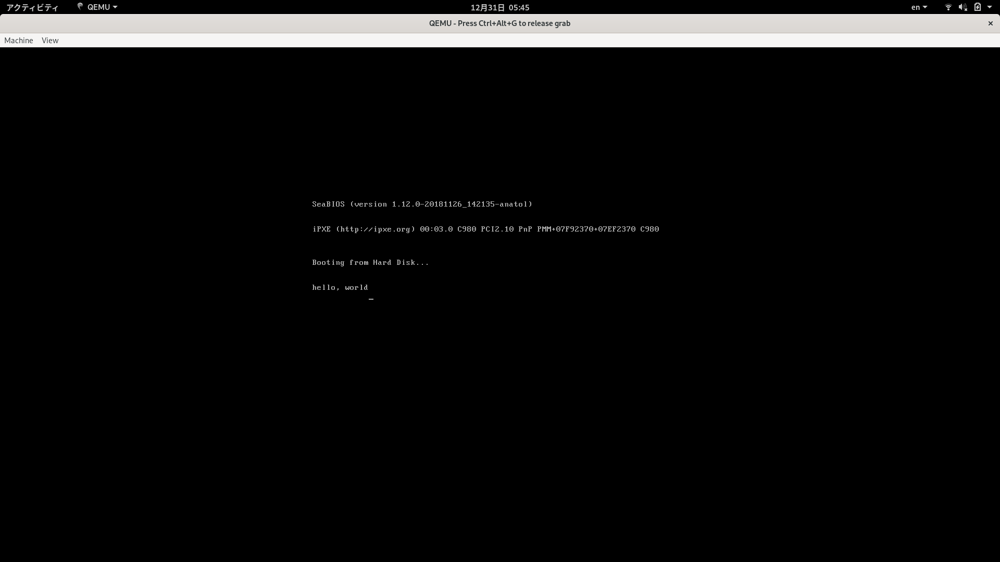

# Chapter 1

バイナリエディタを選ぶ

- bviにした

00の挿入はshell scriptでやった

```

#!/bin/sh
count=0
# loop_count=16
$((loop_count=168000*16))
# target_file="hoge.img"
target_file="hello.img"
while  [ $count -le $loop_count ]
do
  echo -en "\x00" >> $target_file
  echo "count is $count"
  count=`expr $count + 1`
done
```


quem(エミュレーター)をインストール

virglrendererをインストール

qemu-system-x86_64 hello.img





## 参考記事

[30日でOS自作入門挑戦記(Linux) Day1](https://qiita.com/strv13570/items/c20e6b1c7cb68e7ee018)


